# 🫁 Pneumonia Chest X-Ray Classifier

This project implements a **Convolutional Neural Network (CNN)** to detect **pneumonia** from **chest X-ray images**. Built using TensorFlow/Keras and trained on the [Chest X-Ray Images (Pneumonia)](https://www.kaggle.com/datasets/paultimothymooney/chest-xray-pneumonia) dataset.

---

## 📌 Overview

Pneumonia is a serious lung infection that can be diagnosed using radiographic imaging like chest X-rays. This project aims to classify X-ray scans into:

- ✅ **Normal**
- ❌ **Pneumonia**

We use data augmentation, a clean CNN pipeline, and visualization techniques to build an interpretable and efficient model.

---

## 📁 Dataset

The dataset is structured into `train`, `val`, and `test` folders:


📦 Total images: ~5,800  
📊 Format: JPEG grayscale chest X-ray images

---

## 🖼️ Sample Images

<p align="center">
  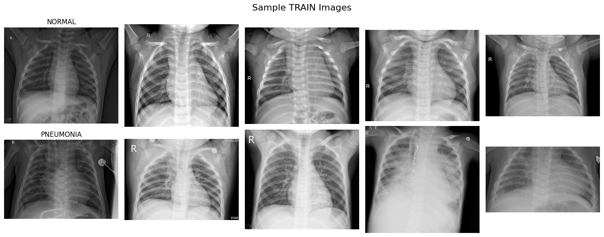
</p>

Above are sample chest X-ray images from the training dataset:
- The **top row** shows healthy (Normal) lungs.
- The **bottom row** shows lungs diagnosed with **Pneumonia**.

These images highlight the visual features used by the model to learn pathology patterns.

## 📊 Class Distribution

<p align="center">
  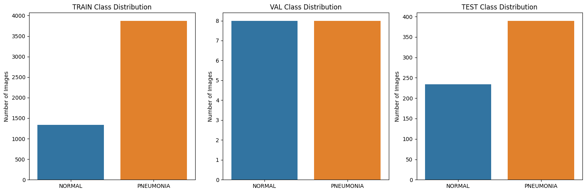
</p>

This bar chart illustrates the number of X-ray images per class (NORMAL vs. PNEUMONIA) across different dataset splits:

- **Training Set** shows moderate class imbalance (more pneumonia cases).
- **Validation Set** is balanced.
- **Test Set** also has more pneumonia cases.

Understanding class distribution is crucial for handling bias and ensuring balanced evaluation.


## 🧠 Model Architecture

A simple **CNN** with:

- 3 × Conv2D layers with ReLU
- MaxPooling after each conv
- Dense + Dropout
- Sigmoid output for binary classification

Want more power? You can upgrade to **EfficientNet**, **ResNet**, or **Transfer Learning**.

---

## 🚀 Training

```bash
python train_cnn.py
```
## 📈 Model Evaluation

We evaluated our trained CNN model on the test set from the **Chest X-Ray Pneumonia** dataset. The results demonstrate strong performance in detecting pneumonia from chest X-rays.

### 🧪 Performance Metrics

- **AUC (ROC):** 0.96
- **Precision, Recall, and F1-score** are also high, as shown below.

### 📊 Confusion Matrix, ROC Curve, and Precision-Recall Curve

The following plot summarizes model performance visually:

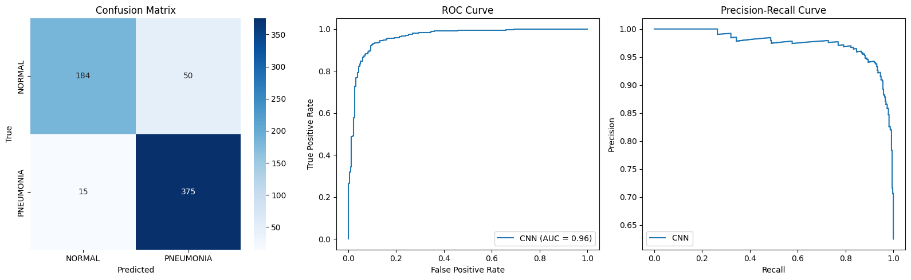 <!-- Replace with actual path if hosted -->

- The model has high **true positive rate** and low **false positive rate**.
- Precision and recall trade-off is strong across thresholds.

### 🩻 Example Predictions on Test Images

Below are a few examples from the test set:

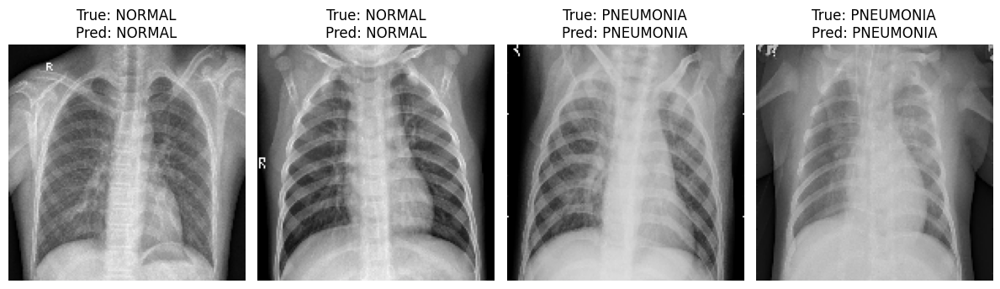 <!-- Replace with actual path if hosted -->

The predictions match the ground truth, showing the model's ability to distinguish between **NORMAL** and **PNEUMONIA** chest X-rays effectively.

---

## 📈 Model Comparison: Custom CNN vs DenseNet121 (Transfer Learning)

We trained and evaluated two models on the Chest X-ray Pneumonia dataset:

- ✅ A custom CNN trained from scratch  
- ✅ A transfer learning model using **DenseNet121** pretrained on ImageNet

---

### 🔬 Evaluation Metrics

| Metric              | Custom CNN       | DenseNet121 (Transfer Learning) |
|---------------------|------------------|---------------------------------|
| **Test Accuracy**   | ~96%             | **87%**                         |
| **ROC AUC**         | 0.9600           | **0.9481**                      |
| **F1-score (Normal)** | 0.85           | **0.81**                        |
| **F1-score (Pneumonia)** | 0.92       | **0.90**                        |
| **Recall (Pneumonia)**  | 0.96        | **0.94**                        |
| **Model Size**      | Small            | Larger                          |
| **Grad-CAM Support**| ✅ Enabled       | ✅ Planned                      |

---

### 📊 DenseNet121 – Evaluation Results

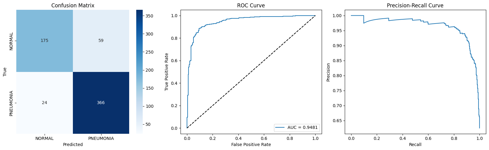

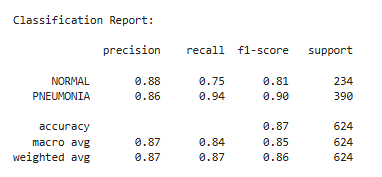

- **Confusion Matrix** and ROC curve show reliable classification performance.
- **Classification Report** shows strong recall for PNEUMONIA class (0.94), with slightly lower recall on NORMAL class (0.75).
- F1-score balances out at **0.90 (Pneumonia)** and **0.81 (Normal)**.

---

### 🧠 Insight

Despite being a powerful pretrained architecture, DenseNet121 slightly underperformed the custom CNN on this dataset. This may be due to:
- The relatively small dataset size
- The model being frozen during training (not fine-tuned)

---

### 🛠️ Next Steps

- ✅ Grad-CAM visualization for DenseNet121
- 🔁 Fine-tune top layers of DenseNet for better generalization
- 📦 Package the best model into a web demo or API

### 🎯 Confidence Threshold Analysis

To better understand the model's behavior across different decision thresholds, we plotted **Precision and Recall vs Confidence Threshold**.

This helps identify optimal thresholds based on the application's needs — for example, prioritizing **recall** in a medical setting to minimize false negatives.

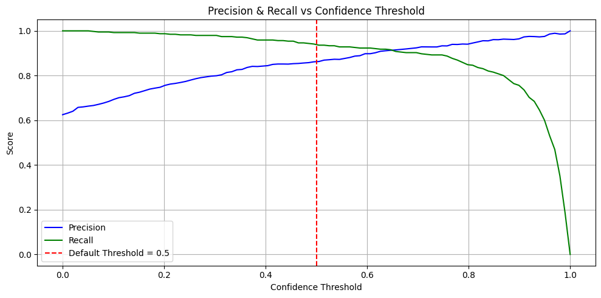

- As expected, **precision increases** and **recall decreases** as confidence threshold rises.
- The default threshold of 0.5 (dashed line) represents a good balance, but the curve allows threshold tuning for specific use cases.

### 🎯 Threshold Optimization with Youden's Index

To improve decision-making beyond the default threshold (0.5), we applied **Youden's J statistic** to determine the optimal classification threshold.

- 📌 **Optimal Threshold (Youden's Index):** `0.7653`
- This threshold balances **recall and specificity** and is suitable for medical screening where minimizing false positives is important.

---

#### 📋 Classification Report @ Threshold = 0.7653

| Class      | Precision | Recall | F1-score | Support |
|------------|-----------|--------|----------|---------|
| NORMAL     | 0.82      | 0.91   | 0.86     | 234     |
| PNEUMONIA  | 0.94      | 0.88   | 0.91     | 390     |
| **Accuracy**     |       |        | **0.89** | 624     |

- Macro F1: **0.89**  
- Weighted F1: **0.89**

---

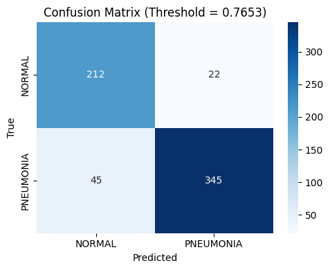

Compared to the default threshold:
- ✅ **Precision increased**, especially for pneumonia
- ✅ **Balanced trade-off** between sensitivity and specificity
- 🚀 Improved overall model reliability for deployment scenarios

### 🔄 Before vs After Applying Youden’s Threshold (0.7653)

We compared the model's evaluation metrics using the **default threshold (0.5)** and the **optimized threshold (0.7653)** obtained via **Youden’s Index**.

| Metric               | Threshold = 0.5   | Threshold = 0.7653 |
|----------------------|------------------|---------------------|
| **Accuracy**         | 0.87             | **0.89**            |
| **Precision (Normal)** | 0.88           | **0.82**            |
| **Recall (Normal)**    | 0.75           | **0.91**            |
| **Precision (Pneumonia)** | 0.86       | **0.94**            |
| **Recall (Pneumonia)**    | 0.94       | **0.88**            |
| **F1-Score (Normal)**    | 0.81         | **0.86**            |
| **F1-Score (Pneumonia)** | 0.90         | **0.91**            |
| **Macro F1**         | 0.85             | **0.89**            |

✅ **Youden's threshold** improved **overall accuracy and F1-score**, especially by increasing the **recall of the NORMAL class** (reducing false positives for pneumonia).  
It's a strong alternative to the default threshold when aiming for **more reliable classification** in clinical or real-world applications.

### 🧮 Youden’s Index Curve

We calculated **Youden’s Index** across a range of thresholds to identify the point that best balances sensitivity (recall) and specificity.

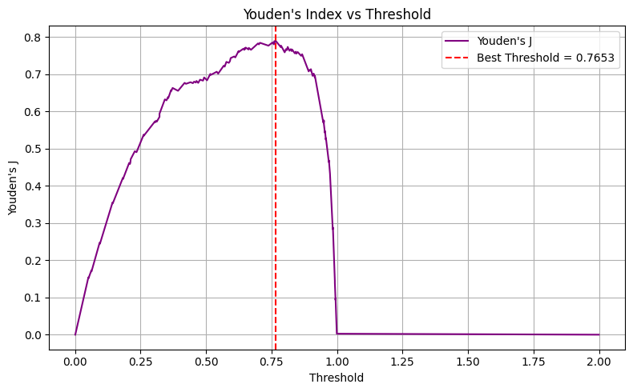

- The peak occurs at **threshold = 0.7653**
- This threshold yielded the highest **Youden’s J (≈ 0.79)**, meaning it provides the most balanced classification
- This threshold was then used for post-optimization evaluation (see results above)

### 🩻 Grad-CAM Visualization (DenseNet121)

We used Grad-CAM to visualize the model’s attention while predicting chest X-rays using the **DenseNet121** model.

This helps us verify whether the model is focusing on medically relevant regions (lungs, opacities) when making decisions.

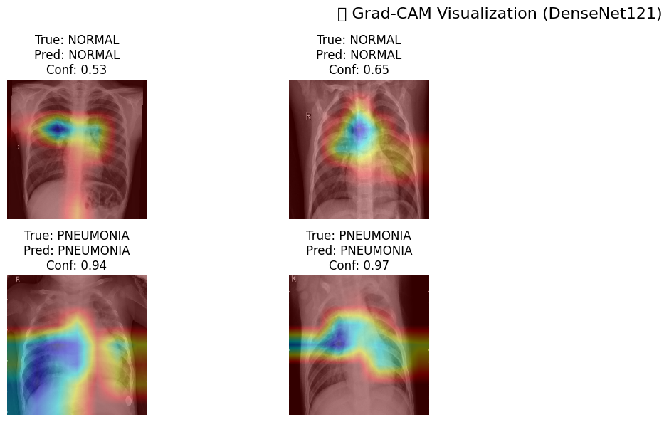

**Observations:**
- ✅ **Correct NORMAL predictions** focus on clear lung regions, with lower confidence heat.
- ✅ **Correct PNEUMONIA predictions** show strong activation around infiltrates or opacities, often in lower lungs.
- ✅ The model shows consistent and localized attention, increasing trust in its predictions.

This visualization supports the model's interpretability and is helpful for clinical validation or decision support systems.

### ⚠️ Misclassification Analysis (Grad-CAM)

We also investigated misclassified examples using Grad-CAM to understand where the model's attention was focused when it made incorrect predictions.

Below is an example where the model **incorrectly predicted "PNEUMONIA"** with high confidence (0.97), while the ground truth label was **"NORMAL"**:

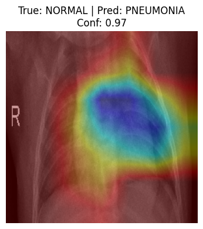

**Observation:**
- The model concentrated on a region in the **right mid-to-lower lung**, where it might have interpreted tissue texture or slight opacity as abnormal.
- This could be:
  - 🔬 A **subtle radiological feature** that resembles pneumonia (but isn’t)
  - ⚠️ A **false positive due to over-sensitivity**, especially after optimizing for high recall
  - 🧠 Or a **labeling inconsistency** — it might not be 100% "normal" (annotation noise is common in real X-ray datasets)

This highlights the importance of Grad-CAM in **interpreting model behavior** and identifying **clinical edge cases**.

### 🔍 Misclassified Case Study: False Positives (NORMAL → PNEUMONIA)

We investigated 10 misclassified test cases using Grad-CAM where the model predicted **PNEUMONIA** on **NORMAL** X-rays with high confidence (>0.75).

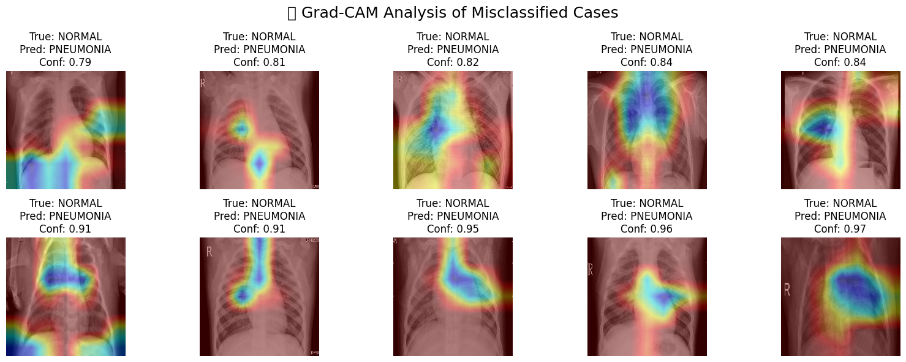

**Findings:**
- Most activations are in the **lower lobes** or **perihilar zones**, consistent with common pneumonia locations
- Some heatmaps highlight **vascular structures or soft-tissue overlaps**, which may have confused the model
- While labeled "NORMAL," a few cases might have **subtle findings** or **labeling uncertainty**

This analysis helps us understand that:
- The model is making **clinically explainable errors**
- Further improvement can come from:
  - Label verification
  - Hard negative mining
  - Improved augmentations to reduce false positives

### 🚨 False Negative Analysis (Missed Pneumonia Cases)

We also examined cases where the model **missed pneumonia**, predicting **"NORMAL"** with confidence below the Youden threshold of 0.7653.

These are especially important in medical applications, as missed diagnoses can be critical.

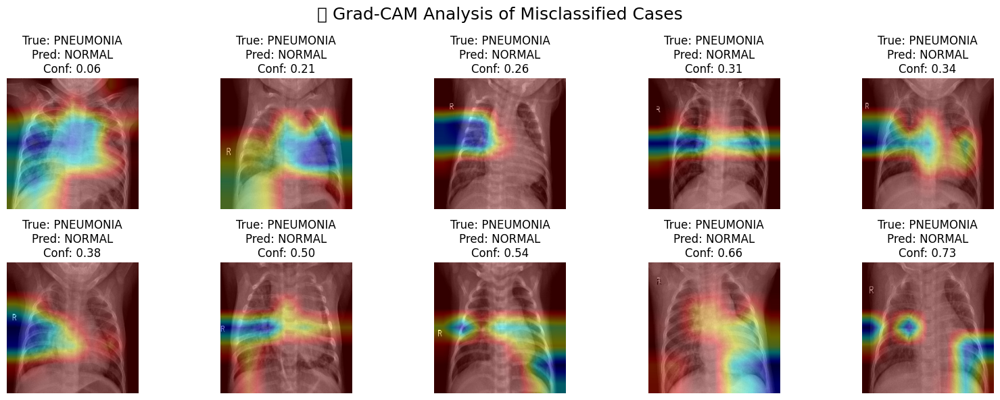

**Observations:**
- Model attention was often **diffused** or focused on **non-relevant areas**
- Some cases showed **no strong activation**, indicating lack of confidence
- A few **borderline cases** had confidence just under the threshold — might benefit from soft-voting or second review
- These highlight the need for:
  - More **sensitive detection of early-stage pneumonia**
  - Possibly **fine-tuning on hard examples**
  - Better handling of **label noise** or visually ambiguous cases


