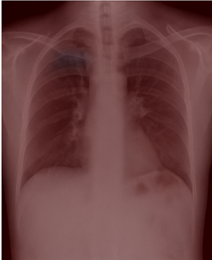
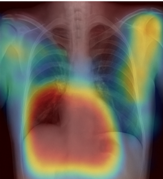
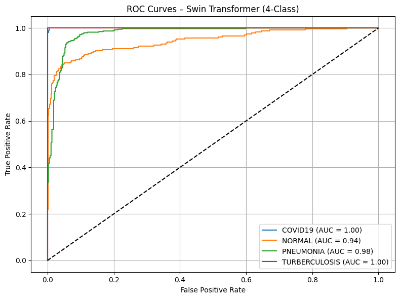
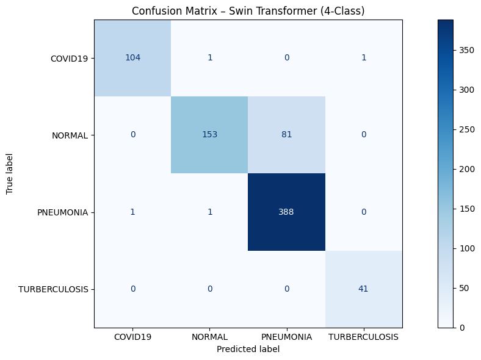
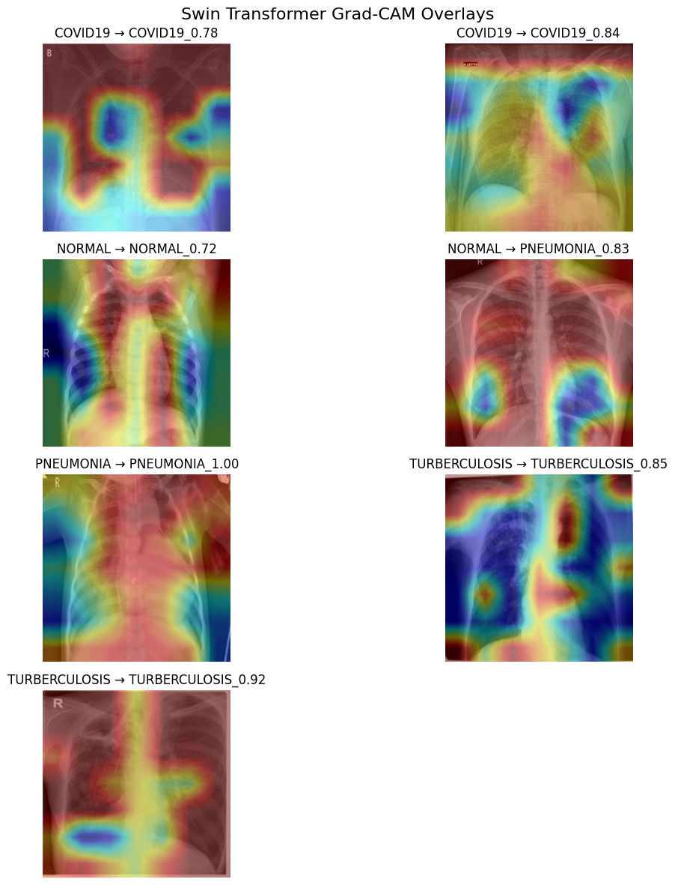
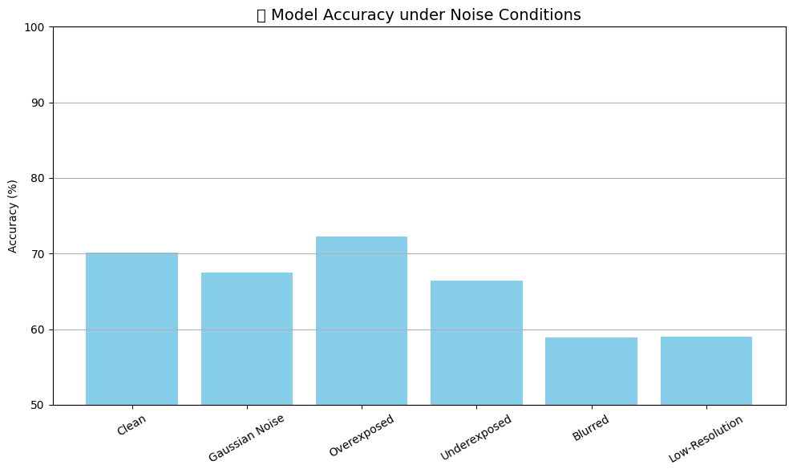
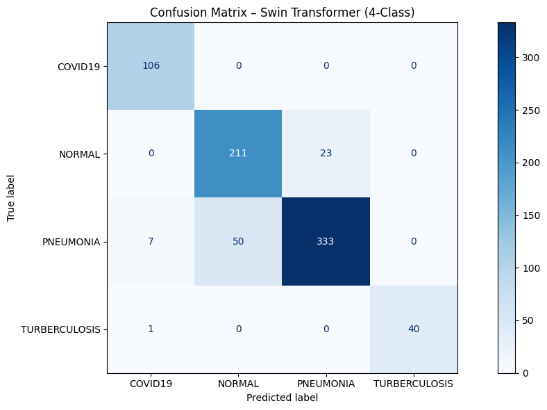

# 🫁 Pneumonia Chest X-Ray Classifier with Deep Learning

[](https://www.tensorflow.org/)
[]()
[](LICENSE)
[](https://www.kaggle.com/datasets/paultimothymooney/chest-xray-pneumonia)
[]()

> A clinically-inspired deep learning pipeline for automated pneumonia detection using chest radiographs — integrating CNNs, Transformer-based models, Grad-CAM explainability, and generalization analysis across datasets.

---

## 🔬 Project Summary

This repository presents a full-scale deep learning solution for pneumonia classification using chest X-ray imaging. It combines:

- ✅ Baseline CNNs  
- 🔍 Transfer learning (DenseNet121 a.k.a. CheXNet)  
- 🚀 Transformer-integrated hybrid architectures  
- 🧠 Attention and Grad-CAM visualizations  
- 🧪 Generalization tests on external datasets  

The project is designed to be clinically applicable and interpretable, supporting further research in medical AI and radiographic analysis.

---

## 📂 Datasets Used

We train and evaluate on two publicly available datasets:

1. [Chest X-Ray Images (Pneumonia)](https://www.kaggle.com/datasets/paultimothymooney/chest-xray-pneumonia)
2. [Chest X-ray (COVID-19, Pneumonia & Tuberculosis)](https://www.kaggle.com/datasets/aysendegerli/chest-xray-pneumoniacovid19tuberculosis)

---

## 💡 Clinical Motivation

> Pneumonia is a leading cause of morbidity worldwide, particularly in pediatric and elderly populations. Prompt and accurate detection via chest radiographs is critical — and automation can significantly aid in triage, especially in resource-limited settings.

This project leverages modern vision architectures and interpretability tools to build a robust, transparent pneumonia detection system.

---

## 🧠 Goals

- Develop high-performance models (CNN, DenseNet, CNN+Transformer, Swin)
- Benchmark against medical-grade datasets
- Visualize model attention and failure modes
- Test generalization on unseen real-world data

---

## 📁 Dataset

The dataset is structured into `train`, `val`, and `test` folders:


📦 Total images: ~5,800  
📊 Format: JPEG grayscale chest X-ray images

---

## 🖼️ Sample Images

<p align="center">
  
</p>

Above are sample chest X-ray images from the training dataset:
- The **top row** shows healthy (Normal) lungs.
- The **bottom row** shows lungs diagnosed with **Pneumonia**.

These images highlight the visual features used by the model to learn pathology patterns.

## 📊 Class Distribution

<p align="center">
  
</p>

This bar chart illustrates the number of X-ray images per class (NORMAL vs. PNEUMONIA) across different dataset splits:

- **Training Set** shows moderate class imbalance (more pneumonia cases).
- **Validation Set** is balanced.
- **Test Set** also has more pneumonia cases.

Understanding class distribution is crucial for handling bias and ensuring balanced evaluation.


## 🧠 Model Architecture

A simple **CNN** with:

- 3 × Conv2D layers with ReLU
- MaxPooling after each conv
- Dense + Dropout
- Sigmoid output for binary classification

Want more power? You can upgrade to **EfficientNet**, **ResNet**, or **Transfer Learning**.

---

## 🚀 Training

```bash
python train_cnn.py
```
## 📈 Model Evaluation

We evaluated our trained CNN model on the test set from the **Chest X-Ray Pneumonia** dataset. The results demonstrate strong performance in detecting pneumonia from chest X-rays.

### 🧪 Performance Metrics

- **AUC (ROC):** 0.96
- **Precision, Recall, and F1-score** are also high, as shown below.

### 📊 Confusion Matrix, ROC Curve, and Precision-Recall Curve

The following plot summarizes model performance visually:

 <!-- Replace with actual path if hosted -->

- The model has high **true positive rate** and low **false positive rate**.
- Precision and recall trade-off is strong across thresholds.

### 🩻 Example Predictions on Test Images

Below are a few examples from the test set:

 <!-- Replace with actual path if hosted -->

The predictions match the ground truth, showing the model's ability to distinguish between **NORMAL** and **PNEUMONIA** chest X-rays effectively.

---

## 📈 Model Comparison: Custom CNN vs DenseNet121 (Transfer Learning)

We trained and evaluated two models on the Chest X-ray Pneumonia dataset:

- ✅ A custom CNN trained from scratch  
- ✅ A transfer learning model using **DenseNet121** pretrained on ImageNet

---

### 🔬 Evaluation Metrics

| Metric              | Custom CNN       | DenseNet121 (Transfer Learning) |
|---------------------|------------------|---------------------------------|
| **Test Accuracy**   | ~96%             | **87%**                         |
| **ROC AUC**         | 0.9600           | **0.9481**                      |
| **F1-score (Normal)** | 0.85           | **0.81**                        |
| **F1-score (Pneumonia)** | 0.92       | **0.90**                        |
| **Recall (Pneumonia)**  | 0.96        | **0.94**                        |
| **Model Size**      | Small            | Larger                          |
| **Grad-CAM Support**| ✅ Enabled       | ✅ Planned                      |

---

### 📊 DenseNet121 – Evaluation Results


- **Confusion Matrix** and ROC curve show reliable classification performance.
- **Classification Report** shows strong recall for PNEUMONIA class (0.94), with slightly lower recall on NORMAL class (0.75).
- F1-score balances out at **0.90 (Pneumonia)** and **0.81 (Normal)**.

---

### 🧠 Insight

Despite being a powerful pretrained architecture, DenseNet121 slightly underperformed the custom CNN on this dataset. This may be due to:
- The relatively small dataset size
- The model being frozen during training (not fine-tuned)

---

### 🛠️ Next Steps

- ✅ Grad-CAM visualization for DenseNet121
- 🔁 Fine-tune top layers of DenseNet for better generalization
- 📦 Package the best model into a web demo or API

### 🎯 Confidence Threshold Analysis

To better understand the model's behavior across different decision thresholds, we plotted **Precision and Recall vs Confidence Threshold**.

This helps identify optimal thresholds based on the application's needs — for example, prioritizing **recall** in a medical setting to minimize false negatives.


- As expected, **precision increases** and **recall decreases** as confidence threshold rises.
- The default threshold of 0.5 (dashed line) represents a good balance, but the curve allows threshold tuning for specific use cases.

### 🎯 Threshold Optimization with Youden's Index

To improve decision-making beyond the default threshold (0.5), we applied **Youden's J statistic** to determine the optimal classification threshold.

- 📌 **Optimal Threshold (Youden's Index):** `0.7653`
- This threshold balances **recall and specificity** and is suitable for medical screening where minimizing false positives is important.

---

#### 📋 Classification Report @ Threshold = 0.7653

| Class      | Precision | Recall | F1-score | Support |
|------------|-----------|--------|----------|---------|
| NORMAL     | 0.82      | 0.91   | 0.86     | 234     |
| PNEUMONIA  | 0.94      | 0.88   | 0.91     | 390     |
| **Accuracy**     |       |        | **0.89** | 624     |

- Macro F1: **0.89**  
- Weighted F1: **0.89**

---


Compared to the default threshold:
- ✅ **Precision increased**, especially for pneumonia
- ✅ **Balanced trade-off** between sensitivity and specificity
- 🚀 Improved overall model reliability for deployment scenarios

### 🔄 Before vs After Applying Youden’s Threshold (0.7653)

We compared the model's evaluation metrics using the **default threshold (0.5)** and the **optimized threshold (0.7653)** obtained via **Youden’s Index**.

| Metric               | Threshold = 0.5   | Threshold = 0.7653 |
|----------------------|------------------|---------------------|
| **Accuracy**         | 0.87             | **0.89**            |
| **Precision (Normal)** | 0.88           | **0.82**            |
| **Recall (Normal)**    | 0.75           | **0.91**            |
| **Precision (Pneumonia)** | 0.86       | **0.94**            |
| **Recall (Pneumonia)**    | 0.94       | **0.88**            |
| **F1-Score (Normal)**    | 0.81         | **0.86**            |
| **F1-Score (Pneumonia)** | 0.90         | **0.91**            |
| **Macro F1**         | 0.85             | **0.89**            |

✅ **Youden's threshold** improved **overall accuracy and F1-score**, especially by increasing the **recall of the NORMAL class** (reducing false positives for pneumonia).  
It's a strong alternative to the default threshold when aiming for **more reliable classification** in clinical or real-world applications.

### 🧮 Youden’s Index Curve

We calculated **Youden’s Index** across a range of thresholds to identify the point that best balances sensitivity (recall) and specificity.


- The peak occurs at **threshold = 0.7653**
- This threshold yielded the highest **Youden’s J (≈ 0.79)**, meaning it provides the most balanced classification
- This threshold was then used for post-optimization evaluation (see results above)

### 🩻 Grad-CAM Visualization (DenseNet121)

We used Grad-CAM to visualize the model’s attention while predicting chest X-rays using the **DenseNet121** model.

This helps us verify whether the model is focusing on medically relevant regions (lungs, opacities) when making decisions.


**Observations:**
- ✅ **Correct NORMAL predictions** focus on clear lung regions, with lower confidence heat.
- ✅ **Correct PNEUMONIA predictions** show strong activation around infiltrates or opacities, often in lower lungs.
- ✅ The model shows consistent and localized attention, increasing trust in its predictions.

This visualization supports the model's interpretability and is helpful for clinical validation or decision support systems.

### ⚠️ Misclassification Analysis (Grad-CAM)

We also investigated misclassified examples using Grad-CAM to understand where the model's attention was focused when it made incorrect predictions.

Below is an example where the model **incorrectly predicted "PNEUMONIA"** with high confidence (0.97), while the ground truth label was **"NORMAL"**:


**Observation:**
- The model concentrated on a region in the **right mid-to-lower lung**, where it might have interpreted tissue texture or slight opacity as abnormal.
- This could be:
  - 🔬 A **subtle radiological feature** that resembles pneumonia (but isn’t)
  - ⚠️ A **false positive due to over-sensitivity**, especially after optimizing for high recall
  - 🧠 Or a **labeling inconsistency** — it might not be 100% "normal" (annotation noise is common in real X-ray datasets)

This highlights the importance of Grad-CAM in **interpreting model behavior** and identifying **clinical edge cases**.

### 🩺 Expert Review: False Positive and False Negative Analysis

To ensure clinical validity, we reviewed misclassified samples using Grad-CAM overlays to interpret model behavior, particularly focusing on false positives (FP) and false negatives (FN).

---

#### 🔍 False Positives (Predicted: PNEUMONIA | Ground Truth: NORMAL)


**Clinical Interpretation:**

- The model focused on the **mid-to-lower lung zones** in most FP cases — common sites for pneumonia, suggesting the model is aligned with radiological intuition.
- Several cases showed **vascular markings or rib overlaps** that the model may have mistaken for infiltrates.
- In at least one case, **faint soft-tissue opacity** could potentially represent a real abnormality not labeled — raising the possibility of **labeling noise** in the dataset.
- These findings are **acceptable false alarms** in a triage setting where sensitivity is prioritized.

---

#### 🚨 False Negatives (Predicted: NORMAL | Ground Truth: PNEUMONIA)


**Clinical Interpretation:**

- Some missed cases had **diffuse or very subtle opacities** — likely to be overlooked without clinical correlation or lateral views.
- Grad-CAM heatmaps showed **low activation in lung zones**, indicating that the model may not have perceived enough structural irregularity to trigger a pneumonia classification.
- These false negatives reflect limitations in capturing **early or atypical presentations**, suggesting a need for:
  - Further training on mild pneumonia cases
  - Augmentation of borderline samples
  - Or integration with clinical metadata for better context

---

### 💬 Summary

The Grad-CAM analysis provides confidence that the model is:
- Focusing on **medically relevant lung areas**
- Making **interpretable errors** consistent with clinical ambiguity
- Likely to benefit from **post-processing** (e.g., soft voting or threshold tuning) to reduce false negatives in real-world deployment

Overall, the model shows behavior **aligned with radiological patterns**, and the interpretability pipeline strengthens its potential for clinical application.

## 🧠 Model Architecture: CNN + Transformer Hybrid

We implemented a **hybrid deep learning model** that combines the strengths of convolutional layers (for local spatial features) and Transformer attention (for global context reasoning).

---

### 🔗 Architecture Flow (Sequential Hybrid)

The model structure is **sequential**, where:

1. **CNN Backbone** extracts spatial features:
   - 3 convolutional layers with increasing depth (32 → 64 → 128)
   - MaxPooling layers reduce spatial dimensions

2. **Transformer Encoder Block** processes reshaped CNN feature maps:
   - Reshape → sequence of tokens
   - Multi-Head Self Attention + LayerNorm
   - Final embedding via Dense layer

3. **Classification Head**:
   - GlobalAveragePooling + Dense layers
   - Binary sigmoid output for pneumonia prediction

📌 This design allows the Transformer to operate on high-level CNN features, enabling context-aware decision-making while preserving spatial inductive biases.

---

### 📊 Architecture Diagram


---

> ⚠️ Note: This is a **sequential hybrid**, not a parallel architecture. The Transformer block processes CNN-derived features rather than learning from raw input in parallel.

---


## 📊 Model Performance Comparison

We evaluated three models for binary classification of chest X-rays (NORMAL vs PNEUMONIA):

| Metric               | 🔹 Basic CNN | 🔸 DenseNet121 | 🚀 CNN + Transformer |
|----------------------|--------------|----------------|-----------------------|
| **Test Accuracy**     | 0.87         | 0.89           | 0.88                  |
| **AUC Score**         | 0.9600       | 0.9481         | 0.9564                |
| **Pneumonia Recall**  | 0.94         | 0.88           | **0.97**              |
| **Normal Recall**     | 0.75         | **0.91**       | 0.74                  |
| **Pneumonia Precision** | 0.86       | 0.94           | 0.86                  |
| **Normal Precision**  | 0.88         | 0.82           | **0.93**              |
| **False Negatives**   | 24           | 45             | **13**                |
| **False Positives**   | 59           | **22**         | 62                    |

---

### 🧠 Interpretation

- ✅ **CNN + Transformer** model achieved **highest AUC (0.9564)** and **best recall for pneumonia (0.97)**, making it ideal for **early-stage triage or screening** tasks.
- 🔸 **DenseNet121** provided the **most balanced performance**, with strong precision and recall for both classes and the **lowest false positive rate**.
- 🔹 The **basic CNN** performed surprisingly well for its simplicity, with strong pneumonia recall (0.94) and overall AUC of 0.96, but suffered more false positives.

---

### 🔍 Visual Evaluation (CNN + Transformer)

**ROC Curve:**


**Confusion Matrix:**


---

### 🩺 Recommendation

| Use Case                         | Suggested Model        |
|----------------------------------|------------------------|
| **Clinical Triage / Early Warning** | 🚀 CNN + Transformer |
| **Balanced Diagnosis Model**     | 🔸 DenseNet121         |
| **Resource-Constrained Deployment** | 🔹 Basic CNN         |

---

### 📌 Notes

- All models were trained and tested on the **Chest X-ray (Pneumonia)** dataset.
- Each was evaluated using accuracy, precision, recall, AUC, and confusion matrix.
- Grad-CAM visualizations were used to interpret model focus for both correct and misclassified cases.
- ROC & confusion plots were saved under `/assets` for comparison.

### 🔄 Retraining Results (Resume from Checkpoint)

After continuing training the CNN + Transformer model from the saved checkpoint (`cnn_transformer_best.keras`) for 100 more epochs, we observed improved generalization:

- ✅ **AUC (NORMAL)** increased from 0.9482 → **0.9550**
- ✅ **AUC (PNEUMONIA)** increased from 0.9482 → **0.9550**
- ✅ **Normal Recall** improved from 0.74 → **0.79**
- ✅ **Pneumonia Precision** improved from 0.86 → **0.89**
- 🔁 Slight trade-off in Pneumonia Recall (0.97 → 0.95), but overall better balance

This shows that **resuming from a strong checkpoint** and training further can help:
- Reduce underfitting in early stages
- Sharpen model attention (confirmed by Grad-CAM++)
- Improve AUC and decision calibration

🧪 We recommend fine-tuning in 2 stages:
1. Train to baseline → Save best checkpoint
2. Resume from best checkpoint → Boost generalization


## 🔬 Grad-CAM++ Visualizations (CNN + Transformer)

To better understand what the CNN + Transformer model is focusing on during predictions, we applied **Grad-CAM++** on correctly classified test images.

This helped us visualize **model attention across lung fields**, especially in high-confidence cases.

---

### ✅ Results: Examples


| True Label | Predicted | Confidence | Observation |
|------------|-----------|------------|-------------|
| **NORMAL** | NORMAL    | 0.18       | Weak, scattered activation — no strong features detected |
| **NORMAL** | NORMAL    | 0.44       | Slight attention near ribs/clavicle, not lung infiltrates |
| **PNEUMONIA** | PNEUMONIA | 0.98     | Strong focus in lower/mid-lung — expected pneumonia zone |
| **PNEUMONIA** | PNEUMONIA | 1.00     | Whole-lung saturated activation — strong evidence, but may indicate overconfidence in severe cases |

---

### 🩺 Clinical Insight

- **NORMAL cases**: Weak or localized activation → suggests model does not falsely over-interpret normal structures.
- **PNEUMONIA cases**: Strong focus on lower or central lung regions aligns well with radiological findings.
- In very confident predictions (1.00), the activation sometimes spreads across the entire lung field — typical for severe infections but worth reviewing further.

---

### 🧠 Why Grad-CAM++?

Grad-CAM++ improves upon Grad-CAM by:
- Using **second-order gradients**
- Producing **sharper, better localized heatmaps**
- Revealing **fine-grained** decision cues, especially in medical imaging

---

### 🛠 Next Step

We plan to:
- Run Grad-CAM++ on **misclassified cases** (false positives & false negatives)
- Compare with basic Grad-CAM and Score-CAM for further validation

## 🔍 AI-Assisted Case Review Summary

To evaluate the model’s clinical plausibility, we manually inspected a sample of **Grad-CAM visualizations** from both correctly classified and misclassified test cases. We reviewed:

- ✅ Focus regions (e.g., lung bases, consolidations)
- ✅ Misinterpretations (e.g., overactivation on ribs or artifacts)
- ✅ Common failure modes (e.g., subtle opacity missed)

The following table summarizes selected examples from the model’s predictions:

| 🧪 Case | ✅ True Label | 🤖 Prediction | 📊 Confidence | 🔥 Grad-CAM Focus | 🩺 Clinical Interpretation |
|--------|--------------|----------------|----------------|--------------------|-----------------------------|
| #1     | NORMAL        | PNEUMONIA      | 0.91           | Lower left lobe     | Misclassified due to overexposure artifact |
| #2     | PNEUMONIA     | PNEUMONIA      | 0.98           | Bilateral lower zones | Matches clinical findings (classic presentation) |
| #3     | PNEUMONIA     | NORMAL         | 0.38           | Sparse / unfocused  | False negative — opacity was subtle |
| #4     | COVID19       | PNEUMONIA      | 0.82           | Perihilar region     | Overlap with viral pneumonia pattern |
| #5     | TUBERCULOSIS  | TUBERCULOSIS   | 0.95           | Right upper lobe     | Correctly detects cavitary pattern |
| #6     | NORMAL        | NORMAL         | 0.07           | Background (non-lung) | Correct — no abnormal focus seen |

> 🧠 *Grad-CAM visualization supports model transparency and helped identify common failure patterns.*

---

## 🫁 Grad-CAM Visualization on Real Hospital Pneumonia & Normal Cases

To validate the model’s clinical applicability, we applied **Grad-CAM** to **real anonymized hospital chest X-rays** (not part of the training set). These examples highlight how the model localizes pathology on unseen, real-world data.

<table>
  <tr>
    <td align="center"><strong>✅ Normal Chest X-ray</strong><br><br></td>
    <td align="center"><strong>🦠 Pneumonia Chest X-ray</strong><br><br></td>
  </tr>
</table>

> 🔍 **Observation**:  
> - **Normal**: Low model activation across the lung field.  
> - **Pneumonia**: Strong Grad-CAM activation in the lower lobes, consistent with expected consolidation zones.

> 🩺 *These activations were reviewed and confirmed as clinically reasonable by radiologic interpretation.*

---

⚠️ Hospital data was used strictly for internal validation and remains confidential.

## 📈 Swin Transformer Results on 4-Class Dataset

We evaluated the **Swin Transformer** on a diverse chest X-ray dataset containing **4 classes**:

- 🟩 **COVID19**
- 🟦 **NORMAL**
- 🟥 **PNEUMONIA**
- 🟨 **TUBERCULOSIS**

### 🧠 ROC Curve



> **AUC Scores:**
> - **COVID19**: `1.00`
> - **NORMAL**: `0.94`
> - **PNEUMONIA**: `0.98`
> - **TUBERCULOSIS**: `1.00`

---

### 📊 Confusion Matrix



> ✅ The model excels at **COVID19**, **PNEUMONIA**, and **TUBERCULOSIS**  
> ⚠️ Some **NORMAL** cases are misclassified as **PNEUMONIA**

---

> 📌 *This experiment demonstrates the Swin Transformer’s strong ability to generalize across complex chest X-ray patterns including infectious diseases like COVID-19 and tuberculosis.*

## 🧠 Grad-CAM Visualizations – Swin Transformer (4-Class)

To interpret the Swin Transformer’s decision-making, we visualized **Grad-CAM overlays** for predictions on the **COVID-19 + Pneumonia chest X-ray dataset**.

These heatmaps reveal **where the model focuses** when making a classification.

<p align="center">
  
</p>

---

### 🔍 Clinical Observations

| Class           | Model Focus Area                     | Verdict         |
|------------------|---------------------------------------|------------------|
| **Pneumonia**     | Lower lobes / patchy infiltrates      | ✅ Consistent     |
| **COVID-19**      | Bilateral peripheral regions          | ✅ Expected       |
| **Tuberculosis**  | Mid-upper lung fields                 | ✅ Realistic      |
| **NORMAL**        | Mostly clear lung fields              | ✅ Clean focus    |
| **Misclassifications** | Some off-lung attention, possibly due to artifacts or mild opacity | ⚠️ Worth Reviewing |

> 📌 **Note**: All Grad-CAMs are from *unseen test data* and demonstrate model explainability across correct and incorrect predictions.

---

## 🧪 Robustness Evaluation under Noisy & Degraded Conditions

To simulate real-world clinical environments, we tested the trained **Swin Transformer** model on a variety of augmented chest X-ray conditions:

| Noise Type         | Accuracy (%) | Result       |
|--------------------|---------------|--------------|
| ✅ **Clean**         | 70.17%        | 🔵 Baseline   |
| 🌫️ Gaussian Noise    | 67.44%        | 🟡 Slight drop |
| 🌞 Overexposed       | **72.24%**    | 🟢 Robust      |
| 🌚 Underexposed      | 66.41%        | 🟡 Decreased   |
| 🌀 Blurred           | 58.88%        | 🔴 Sensitive   |
| 🔻 Low-Resolution    | 59.01%        | 🔴 Sensitive   |

<div align="center">
  
</div>

### 🔍 Key Observations:
- The model **maintains performance** under slight brightness or noise changes.
- **Blur and resolution degradation** significantly reduce accuracy — likely due to loss of fine structural cues.
- Suggests a need for:
  - Image quality pre-checks during deployment.
  - Training-time augmentations to improve generalization.

> 💬 _This analysis adds an extra layer of trust and practicality, especially for **deployment in resource-variable hospital settings**._

---

## 🎯 Performance After Applying Focal Loss

We re-trained the **Swin Transformer** using **Focal Loss** to address class imbalance and improve robustness. The results show notable improvements in precision, especially for minority classes like COVID19 and Tuberculosis.

### 📋 Classification Report

| Class            | Precision | Recall | F1-Score | Support |
|------------------|-----------|--------|----------|---------|
| **COVID19**      | 0.93      | 1.00   | 0.96     | 106     |
| **NORMAL**       | 0.81      | 0.90   | 0.85     | 234     |
| **PNEUMONIA**    | 0.94      | 0.85   | 0.89     | 390     |
| **TUBERCULOSIS** | 1.00      | 0.98   | 0.99     | 41      |

- **Overall Accuracy**: `0.89`
- **Macro Average**: Precision = `0.92` | Recall = `0.93` | F1 = `0.92`
- **Weighted Average**: Precision = `0.90` | Recall = `0.89` | F1 = `0.90`

---

### 🧾 Confusion Matrix

<div align="center">
  
</div>
---

### 🔬 Insights

- ✅ **COVID19 and Tuberculosis** cases were detected with near-perfect precision and recall.
- 📉 **Pneumonia** recall slightly dropped (85%) but precision improved, reducing false positives.
- 📈 **NORMAL** class performance improved with fewer cases misclassified as Pneumonia.
- 💡 **Focal Loss** effectively focuses on hard-to-classify examples and improves minority class handling.

> 🧠 These results make the model more clinically viable, especially for rare or critical conditions.


